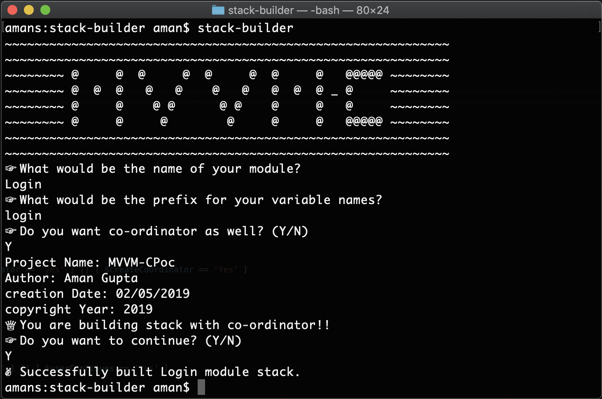

# MVVM-C Stack Builder - Swift

MVVM-C Stack Builder is a bash script used to generate MVVM-C stack from a pre-existing template. It gives you the liberty to choose `C` i.e. Co-ordinators and also gives you customisation over the various configurations like project name, author, etc.

## Installation

Download the stack-builder executable and add the directory where stack-builder resides to the system variables i.e. `.bash_profile`

```bash
$: export PATH=${PATH}:<PATH_TO_STACK_BUILDER_DIRECTORY>
eg: $: export PATH=${PATH}:/Users/aman/Documents/StackBuilder
```
This will add your path temporarily, for one-time setup follow the following instructions

```bash
$: nano ~/.bash_profile
```
Add the PATH variable and save the file.

```bash
export PATH=${PATH}:<PATH_TO_STACK_BUILDER_DIRECTORY>
eg: export PATH=${PATH}:/Users/aman/Documents/StackBuilder
```

```bash
$: source ~/.bash_profile
```

[How to permanently save PATH.](https://stackabuse.com/how-to-permanently-set-path-in-linux/)

## Usage

Before running stack-builder, Please verify that the path for `scaffoldingBaseDirectoryName` is set to the path of the Scaffolding code(which you have downloaded from the repo), to do so you need to open stack-builder in text editor.

```bash 
scaffoldingBaseDirectoryName="/Users/aman/Documents/dev.aman/MVVM/Scaffolding"
```

```bash
$: stack-builder
```

Follow the instructions in the terminal and Build the MVVM-C stack.



You can also customise following properties to personalise your Built Stack, to do so you need to open stack-builder in text editor.

```bash
projectName="MVVM-CPoc"
authorName="Aman Gupta"
now=$(date)
currentDate=$(date -j -f '%a %b %d %T %Z %Y' "$now" "+%d/%m/%Y")
currentYear=$(date -j -f '%a %b %d %T %Z %Y' "$now" "+%Y")
organisationName="dev.aman.poc ventures."
```

## Contributing
Pull requests are welcome. For major changes, please open an issue first to discuss what you would like to change.
